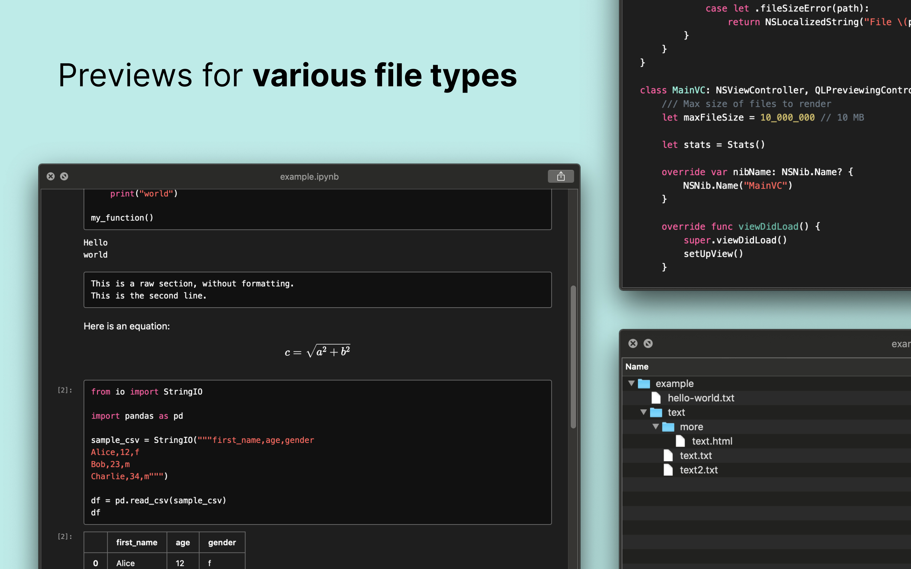
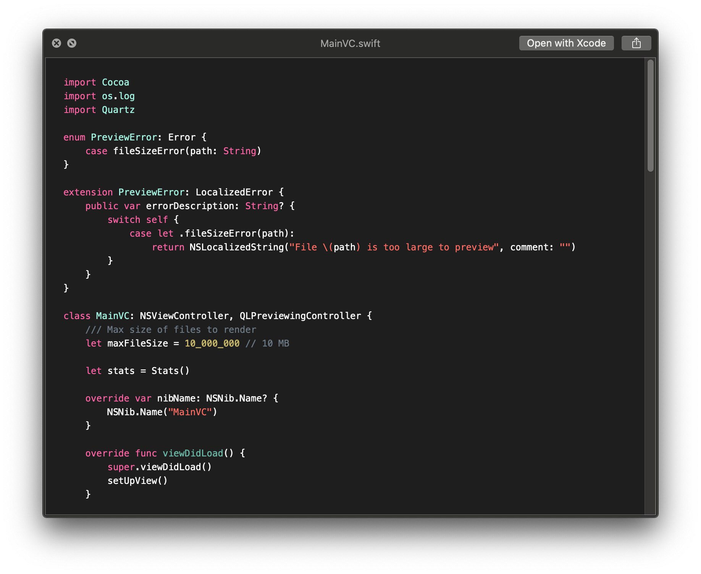
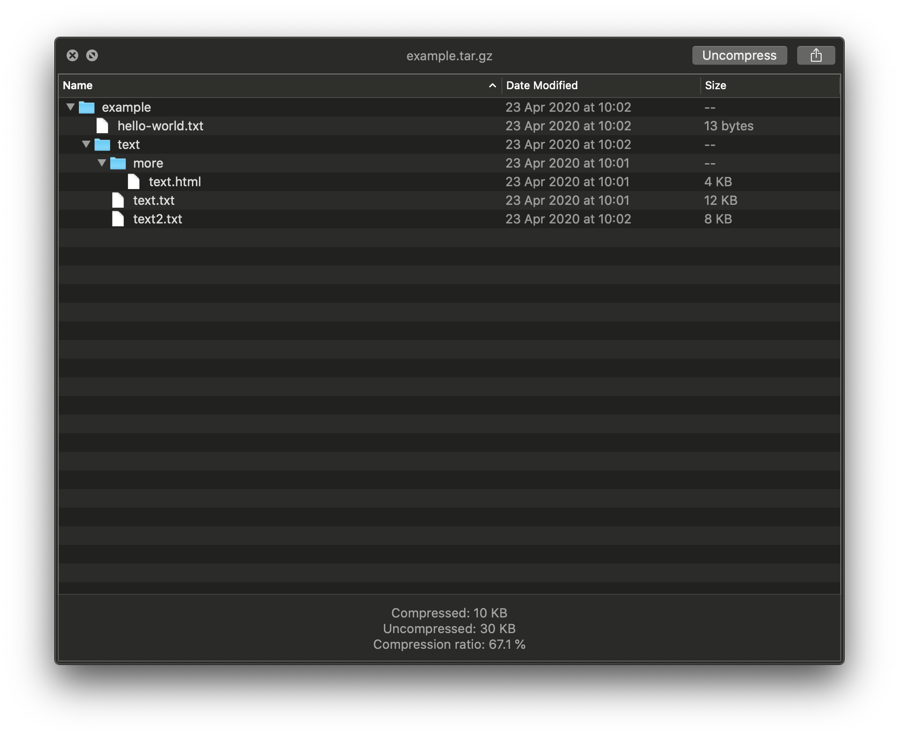
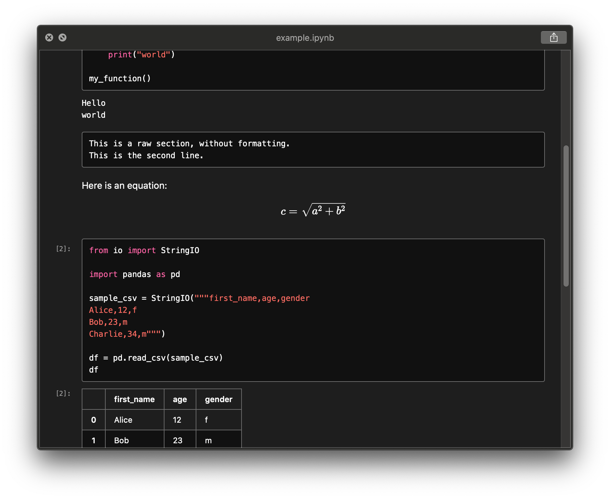
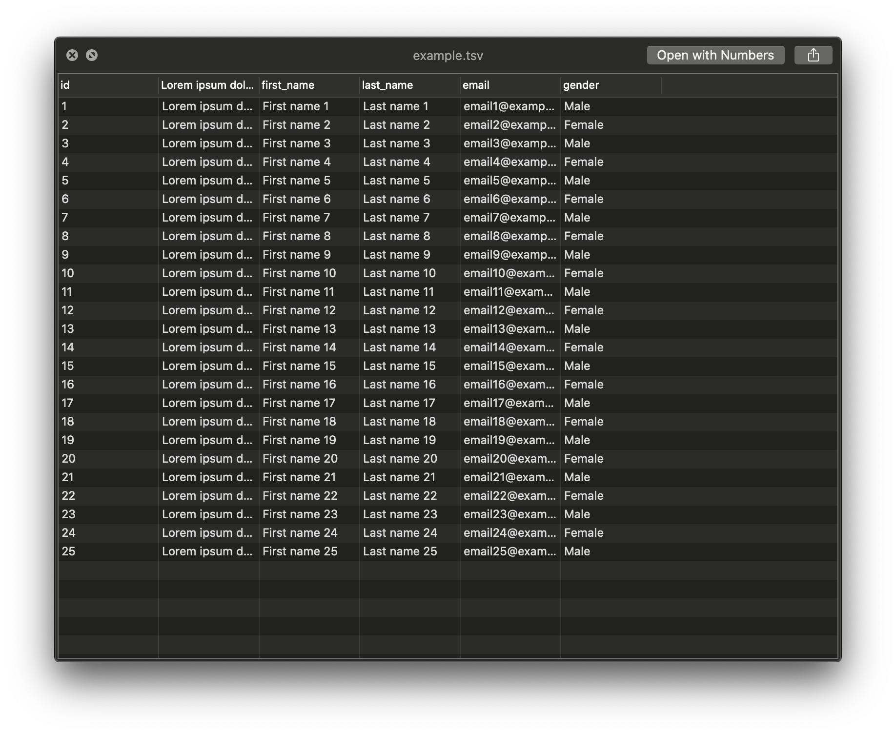

	

	<h1>Glance</h1>
	
<strong>All-in-one Quick Look plugin</strong>

	
Glance provides Quick Look previews for files that macOS doesn't support out of the box.

	

	

## Supported file types

- **Source code** (with [Chroma](https://github.com/alecthomas/chroma) syntax highlighting): `.cpp`, `.js`, `.json`, `.py`, `.swift`, `.yml` and many more

  

- **Markdown** (rendered using [goldmark](https://github.com/yuin/goldmark)): `.md`, `.markdown`, `.mdown`, `.mkdn`, `.mkd`, `.Rmd`

  

- **Archive**: `.tar`, `.tar.gz`, `.zip`

  

- **Jupyter Notebook** (rendered using [nbtohtml](https://github.com/samuelmeuli/nbtohtml)): `.ipynb`

  

- **Tab-separated values** (parsed using [SwiftCSV](https://github.com/swiftcsv/SwiftCSV)): `.tab`, `.tsv`

  

## FAQ

**There are existing Quick Look apps for some of the supported file types. Why create another one?**

- Glance combines the features of many plugins into one and provides consistent and beautiful previews.
- Glance is fully compatible with Dark Mode.
- Some plugins still use the deprecated Quick Look Generator API and might stop working in the future.
- Glance can easily be extended to support other file types.

**Why does Glance require network permissions?**

Glance renders some previews in a `WKWebView`. All assets are stored locally and network access is disabled, but web views unfortunately still need the `com.apple.security.network.client` entitlement to function.

**Why isn't the app available on macOS 10.14 or older?**

The app uses the [new Quick Look API](https://developer.apple.com/documentation/quartz/qlpreviewingcontroller/2867936-preparepreviewoffile) that was introduced in 10.15, so it unfortunately won't work with older versions of macOS.

**Why are images in my Markdown files not loading?**

Glance blocks remote assets. Furthermore, the app only has access to the file that's being previewed. Local image files referenced from Markdown are therefore not loaded.

**Why isn't [file type] supported?**

Feel free to [open an issue](https://github.com/samuelmeuli/glance/issues/new) or [contribute](#contributing)! When opening an issue, please describe what kind of preview you'd expect for your file.

Please note that macOS doesn't allow the handling of some file types (e.g. `.plist`, `.ts` and `.xml`).

**You claim to support [file type], but previews aren't showing up.**

Please note that Glance skips previews for large files to avoid slowing down your Mac.

It's possible that your file's extension or [UTI](https://en.wikipedia.org/wiki/Uniform_Type_Identifier) isn't associated with Glance. You can easily verify this:

1. Check whether the file extension is matched to the correct class in [`PreviewVCFactory.swift`](./QLPlugin/Views/PreviewVCFactory.swift).
2. Find your file's UTI by running `mdls -name kMDItemContentType /path/to/your/file`. Check whether the UTI is listed under `QLSupportedContentTypes` in [`Info.plist`](./QLPlugin/Info.plist).
3. If an association is missing, please feel free to add it and submit a PR.

## Contributing

Suggestions and contributions are always welcome! Please discuss larger changes (e.g. adding support for a new file type) via issue before submitting a pull request.

Xcode, Swift and Go need to be installed to build the app locally.

To add previews for a new file extension, please follow these steps:

1. Create a new class for your file type in [this directory](./QLPlugin/Views/Previews/). It should implement the `Preview` protocol. See the other files in the directory for examples.
2. Match the file extension to your class in [`PreviewVCFactory.swift`](./QLPlugin/Views/PreviewVCFactory.swift).
3. Find your file's UTI by running `mdls -name kMDItemContentType /path/to/your/file`. Add it to `QLSupportedContentTypes` in [`Info.plist`](./QLPlugin/Info.plist).
4. Update [`README.md`](README.md), [`SupportedFilesWC.xib`](Glance/SupportedFilesWC.xib), the [App Store description](AppStore/Listing/Description.txt) and [`Credits.rtf`](Glance/Credits.rtf) (if you introduced a new library).
